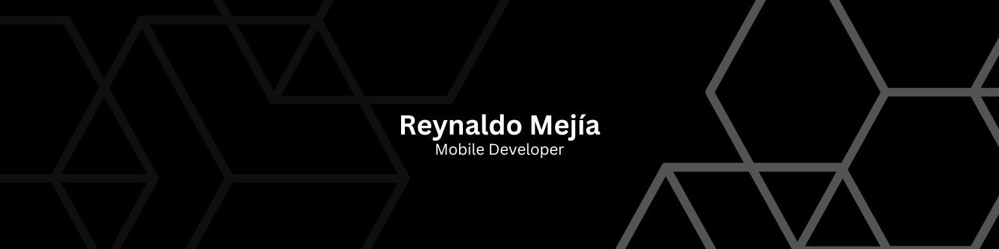

<!--  -->
  

<!-- ## My Portfolio link to repo
[Reynaldo Mejia](https://github.com/redmejia/redmejia.github.io) My portfolio see my work. -->

# My Projects
## Mobile Projects
[Pic App](https://github.com/redmejia/pic)Pic is an Android app designed to capture and store images [video demo](https://drive.google.com/file/d/1gA60xtMNy_9Wpd4ymUuI_YkgzJxSoroN/preview).\
[Hi App](https://github.com/redmejia/hi-app) is a chat app [video demo](https://drive.google.com/file/d/1G5rkvK-HcNyq927vQFzWlH9sD4lU_UIw/preview).\
[Art App](https://github.com/redmejia/art-app) Is an art gallery app [video demo](https://drive.google.com/file/d/1aHMSDldTqQRM_sOxS856eDhJVm1wD34c/preview).\
[NXday](https://github.com/redmejia/next-day) Task management app [video demo](https://drive.google.com/file/d/1sqeGAWfr9GFG5f1znYU6er-NFve07qQo/preview).\
[KeyWord](https://github.com/redmejia/key-word) is my own keyboard app [video demo](https://drive.google.com/file/d/13EUqq0GzbZurJtFkYk18gi4_t82hkX5D/preview).\
[Calculator](https://github.com/redmejia/calculator) This a Udemy projects which is a calculator clone [video demo](https://drive.google.com/file/d/1kex3Xqj7XwUPiigEi_WTeDM-sWyDxvqP/preview).\
[Stop mobile](https://github.com/redmejia/stop-native-app) Nucamp coding bootcamp portfolio mobile version of the [Stop](https://github.com/redmejia/stop).

## Web Projects
[Connect](https://github.com/redmejia/connect) Which is a business to business portfolio project.\
[Walk Store](https://github.com/redmejia/walk) which is small shoe e-commerce.\
[Small Bank](https://github.com/redmejia/sm-bank) is a REST-API project written in Go.\
[Stop](https://github.com/redmejia/stop) Nucamp coding bootcamp portfolio project.\
[Block-e](https://github.com/redmejia/block-e) small project Blockchain with GO.\
[Win Payment](https://github.com/redmejia/win) Processor
Win is a portfolio project for practice microservices architecture using Go(Golang) programming language.

<!-- # I’m currently working on -->
<!-- ## Send
### [Send](https://github.com/redmejia/send) is a mobile app for send and recive money. 
### [Send Services](https://github.com/redmejia/send-services) Microservices for Send mobile app.
## Technologies I use for Send 
  - React Native 
  - Go (Golang)
  - Docker -->

# Learn TypeScript 4 Beginner
Welcome to Learn TypeScript for Beginner, your go-to resource for aspiring developers and individuals eager to dive into the world of programming with TypeScript. If you're new to coding or looking to enhance your skills in this statically-typed superset of JavaScript, you're in the right place! This repositories are crafted to guide you through TypeScript fundamentals.

👉 [TypeScript 4 Beginners](https://github.com/redmejia/learning-typescript).\
👉 [TypeScript 4 Beginners Data Sctructure](https://github.com/redmejia/typescript-data-structure)

<!-- I am thinking 🤔 on what to build for my next project. -->

# LinkedIn

  

#  Technologies
## Back-end and Data Storage

   
   
  <!--   -->
  <!--   -->

## Front-end

  
   
   
  <!--  
    -->
  <!--   -->

<!--
**redmejia/redmejia** is a ✨ _special_ ✨ repository because its `README.md` (this file) appears on your GitHub profile.

Here are some ideas to get you started:

- 🔭 👋 I’m currently working on ...
-🌱 I’m currently learning ... 
- 👯 I’m looking to collaborate on ...
- 🤔 I’m looking for help with ...
- 💬 Ask me about ...
- 📫 How to reach me: ...
- 😄 Pronouns: ...
- ⚡ Fun fact: ...
-->
